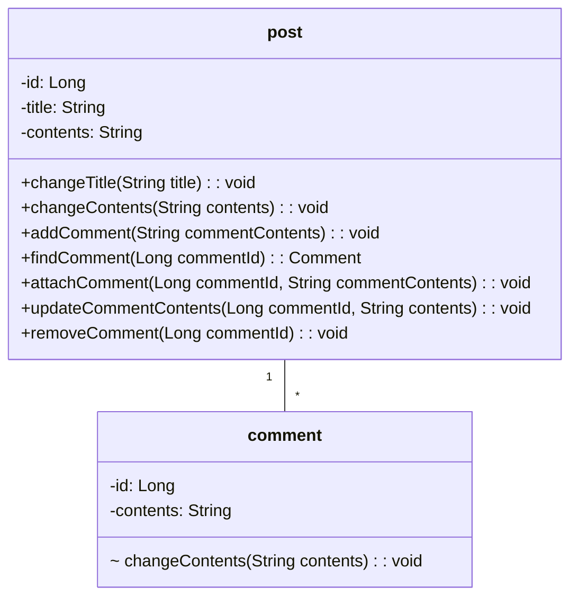

# 관련 이슈

close #n

# 변경된 점

- [x] haha

# 도메인 모델


```mermaid

classDiagram
    class post {
        -id: Long
        -title: String
        -contents: String
        +changeTitle(String title): void
        +changeContents(String contents): void
        +addComment(String commentContents): void
        +findComment(Long commentId): Comment
        +attachComment(Long commentId, String commentContents): void
        +updateCommentContents(Long commentId, String contents): void
        +removeComment(Long commentId): void
    }
    class comment {
        -id: Long
        -contents: String
        ~ changeContents(String contents): void
    }

    post "1" -- "*" comment

```

# 패키지 구조

```text

```