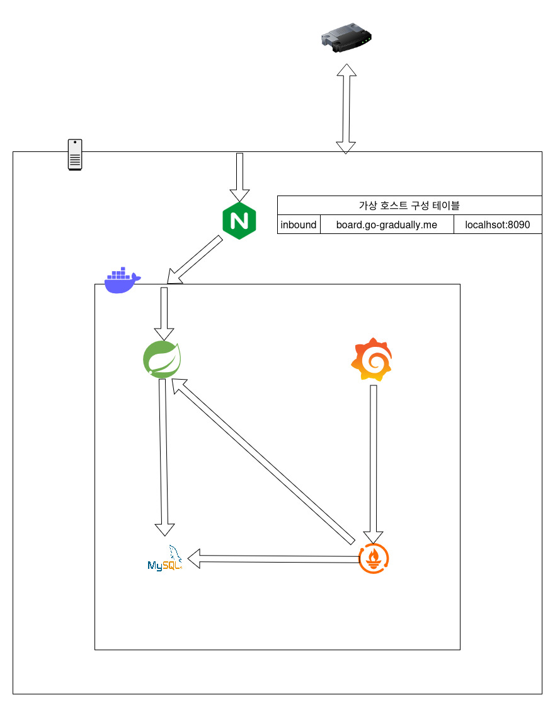
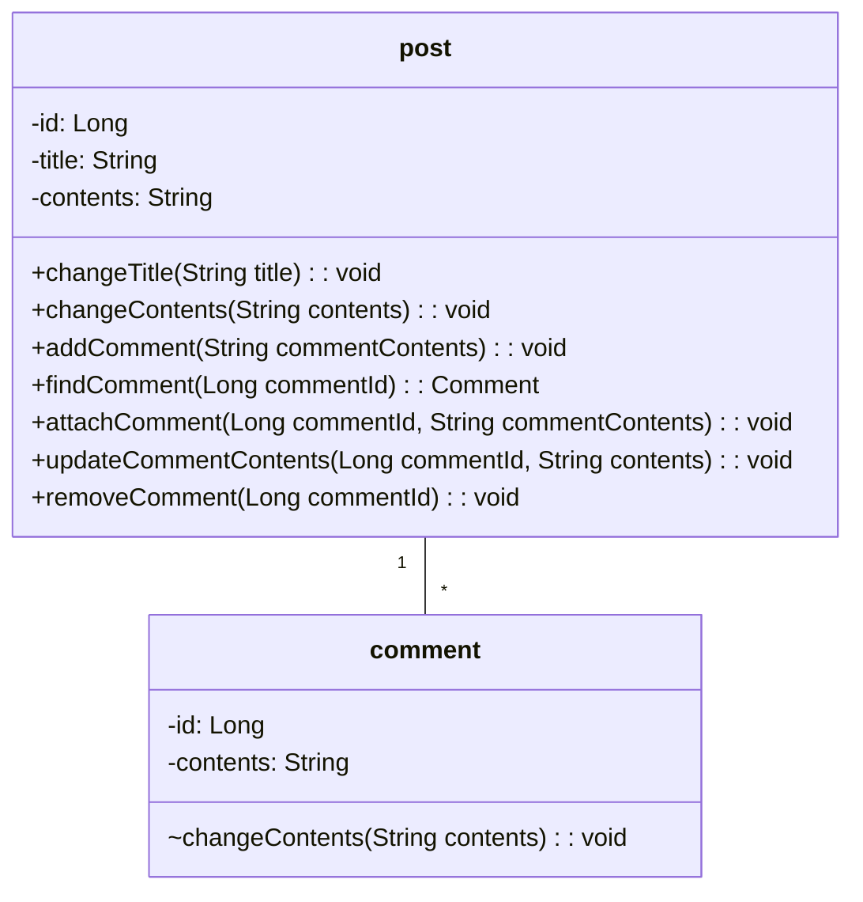

DDD 및 단위 테스트, DB 설계 및 최적화를 학습하기 위한 토이 프로젝트이다.

CI/CD 상태 - [](https://github.com/GoGradually/SuperBoard/actions/workflows/ci-cd.yml)

테스트 코드 커버리지 - [](https://codecov.io/gh/GoGradually/SuperBoard)

# 주요 내용

### 시스템 설계/성능 최적화 관점
- **[쿼리 최적화 - 99.9999% 성능 개선](https://go-gradually.tistory.com/entry/%EA%B2%8C%EC%8B%9C%ED%8C%90-%EB%8C%93%EA%B8%80-%EC%88%98-%EC%A1%B0%ED%9A%8C-%EC%BF%BC%EB%A6%AC-%EC%B5%9C%EC%A0%81%ED%99%94)**

### 객체지향 설계 관점

- [**도메인 주도 설계 적용**
  (DDD 학습 내용)](https://dev.go-gradually.me/entry/%EB%8F%84%EB%A9%94%EC%9D%B8-%EC%A3%BC%EB%8F%84-%EC%84%A4%EA%B3%84DDD%EC%9D%98-%ED%95%B5%EC%8B%AC-%EA%B0%9C%EB%85%90-%EC%A0%95%EB%A6%AC)
- [**GRASP 패턴** - 객체 설계 기준(작성예정)]()
- [학습, 고민 내용 - JDBC Version](https://go-gradually.tistory.com/entry/JdbcTemplate%EC%9D%84-%EC%9D%B4%EC%9A%A9%ED%95%9C-%EA%B2%8C%EC%8B%9C%EA%B8%80-%EB%8C%93%EA%B8%80-%EA%B2%8C%EC%8B%9C%ED%8C%90-%EA%B8%B0%EB%8A%A5-%EA%B5%AC%ED%98%84%EA%B8%B0)
- [게시판 기능 요구사항](board/README.md)

# 프로젝트 구조

## 시스템 아키텍처 다이어그램



## CI/CD 워크플로우


## 도메인 모델


## 패키지 구조

```
src/main/java/jdbc/board/
├── BoardApplication.java
├── application
│   ├── board
│   │   ├── dto
│   │   │   └── PostLine.java
│   │   ├── handler
│   │   ├── repository
│   │   │   └── PostQueryRepository.java
│   │   └── service
│   │       └── PostService.java
│   └── port
│       └── EventPublisher.java
├── config
│   └── EventConfig.java
├── core
│   └── MyEventPublisher.java
├── domain
│   ├── board
│   │   ├── event
│   │   │   ├── CommentCreatedDomainEvent.java
│   │   │   ├── CommentDeletedDomainEvent.java
│   │   │   └── CommentUpdatedDomainEvent.java
│   │   ├── exception
│   │   │   ├── CommentNotFoundException.java
│   │   │   ├── InvalidContentsException.java
│   │   │   ├── InvalidTitleException.java
│   │   │   └── PostNotFoundException.java
│   │   ├── model
│   │   │   ├── Comment.java
│   │   │   └── Post.java
│   │   └── repository
│   │       └── PostRepository.java
│   └── shared
│       └── DomainEvent.java
├── infrastructure
│   ├── handler
│   │   └── CommentEventHandler.java
│   └── repository
│       ├── CommentDaoJDBC.java
│       ├── PostQueryRepositoryJDBC.java
│       └── PostRepositoryJDBC.java
└── interfaces
    ├── dto
    │   ├── CommentRequestDto.java
    │   ├── CommentResponseDto.java
    │   ├── PostRequestDto.java
    │   └── PostResponseDto.java
    └── web
        └── PostController.java

```

# 프로젝트 관리

## 그라운드 룰
- 매주 월요일에, **스프린트 계획을 수립**한다.
    - 이번주에 해야 할 작업을 이슈로 전부 등록한다.
    - 모든 이슈를 등록한 뒤, 해당 이슈들에 대해 스토리 포인트를 지정한다.
        - 스토리 포인트는 피보나치 수열 형태로 기록한다.
        - 한 작업의 스토리 포인트가 21을 넘어갈 경우, 해당 작업을 다수의 작업으로 쪼갠다.
- 매주 일요일에, **스프린트 회고**를 진행한다.
    - KPT 프레임워크를 이용한다.
    - 문제점에 대하여, 피쉬본을 이용한 원인 분석을 수행하고, 해결 방안을 모색한다.
- **GRASP 패턴에 기반한 책임 분리** 및 **클린 아키텍처**를 지향한다.
- **JaCoCo 기준/레이어 단위로 테스트 커버리지 하한선**를 두고, 해당 기준을 만족하지 않을 시 배포를 중단한다.
    - domain: 70%, branch
    - application: 70%, line
- 변경에 대처하는 방법이 테이블이 아닌 도메인 모델에서 발생하도록, **도메인 모델 다이어그램을 매 풀 리퀘스트마다 추가**한다.
- **새로 학습한 내용**에 대하여 블로그 포스팅으로 **기록**을 수행한다.

## PR 형식
```
# 관련 이슈
close #n

# 변경된 점
- [x] haha

# 도메인 모델
mermaid

# 패키지 구조

```

## 아직 구현하지 않은 것
- [ ] 실패 레코드 롤백/재시도 전략(백오프/예외처리 흐름 설계)
- [ ] 비동기/Primary-Secondary(master-slave)구조 설계
- [ ] 대댓글 기능 구현
- [ ] 게시글/댓글 좋아요 기능 구현
- [ ] 추천 순위 실시간 랭킹 기능 구현
- [ ] 조회수 순위 실시간 랭킹 기능 구현
- [ ] 첨부 파일 업로드 기능 구현


---
### 구 프로젝트 - 단일 테이블 상품 재고 관리 (구현 완료)

- [README.md](legacy/product-management-system/README.md)
- CRUD
- JdbcTemplate 기본 문법 학습
- [학습, 고민 내용](https://go-gradually.tistory.com/entry/JdbcTemplate%EC%9D%84-%EC%9D%B4%EC%9A%A9%ED%95%9C-%EC%83%81%ED%92%88-%EA%B4%80%EB%A6%AC-%EA%B8%B0%EB%8A%A5-%EA%B5%AC%ED%98%84%EA%B8%B0)
